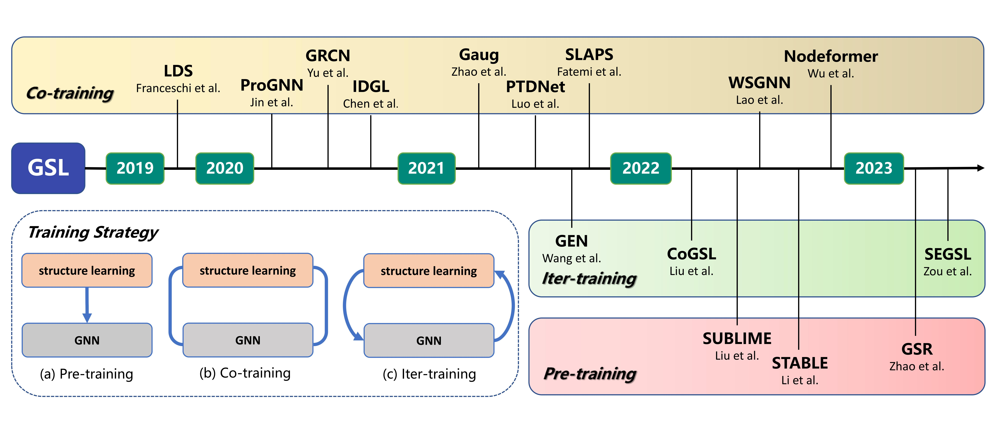
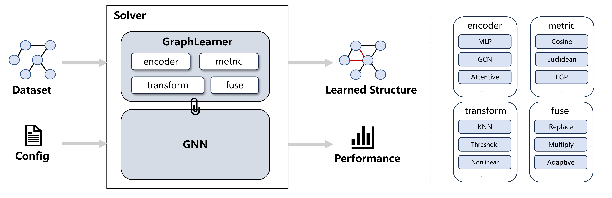

:github_url: https://github.com/OpenGSL/OpenGSL

OpenGSL Documentation
===================================

**OpenGSL** is a benchmark for Graph Structure Learning.

It provides a fair and comprehensive platform to evaluate existing GSL works and facilitate future GSL researches.

.. note::

   This project is under active development.

Citation
--------

If you use our benchmark in your works, we would appreciate citations to the paper:

.. code-block:: bibtex

   @article{zhou2023opengsl,
   title={OpenGSL: A Comprehensive Benchmark for Graph Structure Learning},
   author={Zhiyao Zhou, Sheng Zhou, Bochao Mao, Xuanyi Zhou, Jiawei Chen, Qiaoyu Tan, Daochen Zha, Can Wang, Yan Feng, Chun Chen},
   journal={arXiv preprint},
   year={2023}
   }

.. toctree::
   :glob:
   :maxdepth: 3
   :caption: Getting Started

   notes/installation
   notes/example

.. toctree::
   :glob:
   :maxdepth: 3
   :caption: Modules

   opengsl.config
   opengsl.data
   opengsl.expmanager
   opengsl.module
   opengsl.utils

Indices and tables
==================

* :ref:`genindex`
* :ref:`modindex`
* :ref:`search`
